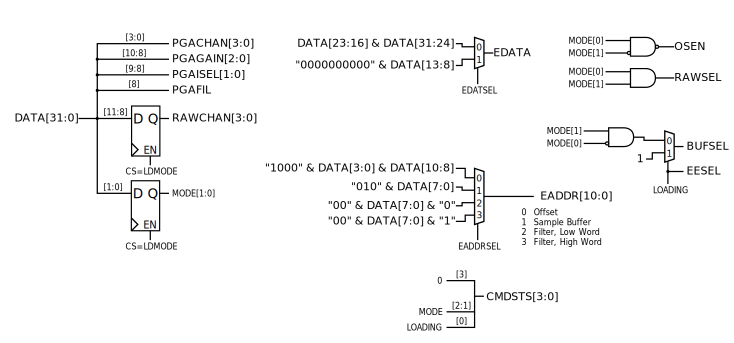

Control
--------

The control module (figures :latex:`ref{fpga_control}` and
:latex:`ref{figure_control_fsm}`) handles mode changes, gain and
filter setting changes, and the storage and retrieval of settings and
filter coefficients from the EEPROM.

   
   State control and decoding. 

.. figure:: control.fsm.svg
   :autoconvert:
   :latexwidth: 6.5in
   :label: fpga_control_fsm

   State control finite state machine. 

