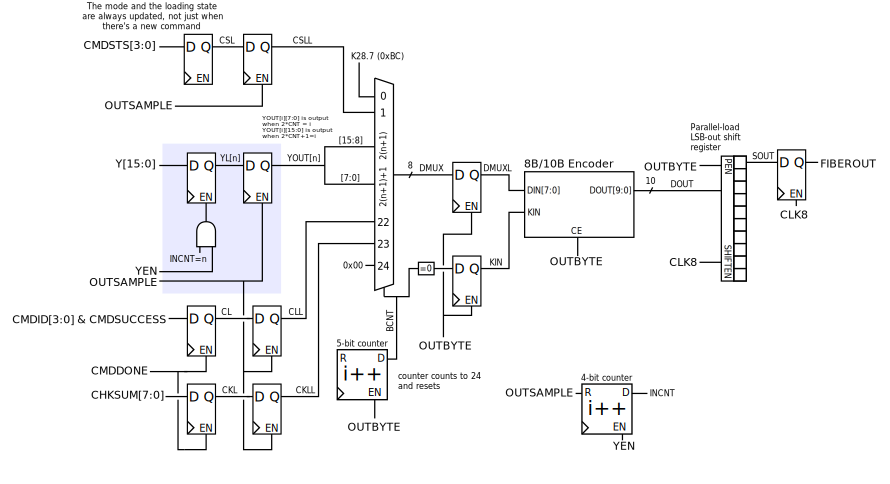

The Fiber TX module
--------------------

The Fiber TX module (figure :latex:`ref{fpga_fibertx}`) formats data
for transmission according to the Soma FiberIO Protocol. All inputs
are latched on the :signal:`OUTSAMPLE` signal to prevent word-skew.

The counter :signal:`INCNT` counts the assertion of the input
:signal:`YEN` to write samples from the output of the RMAC. These are
stored in an appropriate array of registers :signal:`YL[n]`.

A giant mux controlled by an :signal:`OUTBYTE`-enabled counter
multiplex the relevant words into the 8b/10b encoder.

A simple parallel-load LSB-out shift register takes the 10-bit encoded
data :signal:`DOUT` and serializes it to the eventual output
:signal:`FIBEROUT`.

   The Fiber Transmission interface
