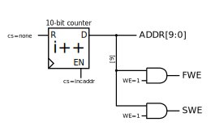

Loader
------------------

The loader simply handles the bulk transfer of data from the EEPROMIO
into the filter array and the sample buffer on mode transition. The
addresses of the EEPROM are decoded into the filter write-enable
(:signal:`FWE`) and sample buffer write-enable (:signal:`SWE`) signals.

.. figure:: loader.fsm.svg
   :autoconvert:
