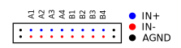
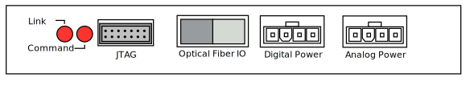

***********************************
Hardware IO
***********************************

Front Panel
============

The front panel of the acquisiton module has the 20-pin input for all
8 differential channel pairs of amplifier input.

   The front panel connector for the Soma Acquisition Module.
   AGND is connected to the amplifier analog ground.   

The connector is a dual-row, twenty-pin 0.100-inch pitch IDC
connector.

Back Panel
================

The back panel (Figure \ref{backpanel}) contains power, IO, and
debugging information. There are four sections of interest.

   The back of the Soma Acquisition Module.

Status LEDs
------------

There are two status LEDs on the back of the module:

   - **Link** : indicates the link with the Soma backplane (over the
     optical fiber) is functioning properly.
   - **Command**: Flashes briefly every time the Soma Backplane sends
     a command to the acqboard.

JTAG port
----------

The JTAG port is the standard 14-pin 2mm-pitch JTAG connector for
Xilinx FPGAs, allowing both programming of the on-board flash and
debugging. This mates with any of the Xilinx programming cables, such
as the Xilinx Parallel Cable IV :bibcite:`Xilinx_Parallel_2004`. 

.. figure:: enclosure.back.jtag.svg
   :autoconvert:
   	    
   The JTAG port, which conforms to the standard Xilinx pinout. 

Optical Fiber IO
--------------------

The optical fiber interface takes two 1-mm 650nm wavelength
plastic optical fibers. The receiver and transmitter colorings
match up with the associated ends of the plastic optical fiber, 
eliminating polarity mistakes. 

   
   The optical fiber interface.

Analog and Digital Power
-------------------------

Powering analog and mixed signal data acquisition devices is always a
challenge, as the exact nature of the power distribution scheme can
substantially impact analog performance. The power connectors mate
with a Molex 39-01-4041 four-pin connector (and associated female pins
44476-3112).

The Acquisition module completely isolates its internal analog and
digital power supplies for maximum signal integrity. The digital power
supply requires 5 volts DC. Analog requires a very clean bipolar |pm|
5V DC.

.. figure:: enclosure.back.power.svg
   :autoconvert:

   The analog and digital power ports. DVDD=+5V, AVDD=+5V, AVSS=-5V. 

