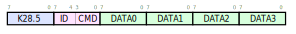
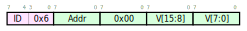

*************************************
Operation and interfacing
*************************************

The acquisition board has four modes of operation, one normal
multichannel mode, one mode for offset compensation, one mode for link
testing with simulated output, and one mode for single-channel test.

Interfacing with the Acquisition board is accomplished via a plastic
optical fiber interface for enhanced electrical isolation even over
long data transmission distances.

Modes
=================
The acquisition board has four modes of operation, designed to set the
internal state and prevent accidental configuration modification
during operation.

**Normal acquisition mode (Mode 0)**
       Mode 0 is the normal acquisition mode; in this mode all 10 channels
       are sampled at the full normal sampling rate and the data is
       transmitted over the 8b/10b bus using the standard Encoding Scheme. In
       this mode, gain and hardware filter settings can be changed, but
       nothing else.

**Offset disable mode (Mode 1)**
       Offset disable mode disables the internal offset compensation. The
       values transmitted are thus the actual measured ADC values. This is
       the only mode in which new offset values can be saved to the board's
       internal non-volatile memory (EEPROM).

**Input disable mode (Mode 2)**
      Input disable mode disables all reading from the ADCs; in
      this mode no change of input or analog settings has any effect on the
      board. While in this mode, the board will continuously transmit a test
      pattern stored in the on-board EEPROM.

      In this mode, both the test pattern and the digital low-pass filter
      can be modified and written to. The sample pattern **is** filtered by
      the digital filter, and can be used as a mechanism to verify that the
      filter coefficients were properly written.

**Raw mode (Mode 3)**
    Raw mode simply outputs the raw, unfiltered, non-decimated
    data from a single selected channel. The 192 ksps data stream occupies
    multiple words in the transmitted data stream. This can be useful to
    characterize the analog properties of a given channel, and to debug
    signal integrity problems.

Fiber IO
==========

The Acquisition Board's external interface is a bidirectional 8 MHz
fiber-optic link over  1mm plastic optical fiber. Both the TX
and RX streams are encoded using 8b/10b encoding.

The Acqboard transmits an 8b/10b-encoded frame of 24 bytes, preceded
by the K28.5 comma character. The nominal frame transmission is as
follows:

.. figure:: txpacket.svg
   :autoconvert:
   :pngdpi: 150

CMDST is a 3-bit field; CMDST[1:0] are the mode numbers; CMDST[0] is
high **after we have just switched into this mode, while this
  mode is loading.** Mode switching is not instantaneous because the
board needs to read values from EEPROM, a (comparatively) slow
process.

Every command sent has a 4-bit command id (CMDID); when a command is
\textit{done executing} the output command id is changed to reflect
this. CMDRP is the command response field; CMDRP[4:1] are the bits of
the most-recently executed CMDID; CMDRP[0] tells whether or not this
command was successful.

The data fields are 1.15-bit twos-complement fixed point samples from
their corresponding ADCs; they are transmitted MSB first.

\emph{Normally, the acqboard receives a stream of valid 8b/10b encoded
  zeros; a new command is signalled by the presence of the comma
  character in the data stream followed by a packet. } which looks as follows:

Commands
============

The following commands are valid in any mode

Universal Commands
------------------

Switch Mode
^^^^^^^^^^^^

.. figure:: switchmode.cmd.svg
   :autoconvert:
   :pngdpi: 150

Switch the current acqboard mode to \textsc{mode}. If changing to the
RAW mode, the \textsc{chan} field is the 4-bit number of the raw
channel you are reading from -- otherwise the field is ignored.

Note that some mode transitions can take up to 300 ms; during this
time the transmitted packet's CMDST will reflect the new mode, but the
``loading'' bit will be set until the mode has been entered. Only once
loading is completed will the CMDID be updated.

Set Gain
^^^^^^^^

.. figure:: setgain.cmd.svg
   :autoconvert:
   :pngdpi: 150

Sets the gain of channel \textsc{Chan} to one of the preset gain
values \textsc{Gain}. Valid in all modes.

Set Input
^^^^^^^^^
.. figure:: setinput.cmd.svg
   :autoconvert:
   :pngdpi: 150

Select which of the four channels will be used for tetrode a and B's
continuous channel.

High Pass Filter Enable
^^^^^^^^^^^^^^^^^^^^^^^

.. figure:: setfilter.cmd.svg
   :autoconvert:
   :pngdpi: 150

Enable (\textsc{filter}= 1) or disable (\textsc{filter}=0) the high
pass filter on channel \textsc{chan}.

Mode 1 Commands
----------------

Write offset
^^^^^^^^^^^^^
.. figure:: writeos.cmd.svg
   :autoconvert:
   :pngdpi: 150

This command writes the 16-bit twos-complement value in V as the
digital offset for channel \textsc{chan} when the gain on that channel
is set to \textsc{gain}. This is only valid in offset-disable mode as
to properly measure the zero offsets you'd need to have offsets
disabled.

Mode 2 Commands
----------------

Write filter
^^^^^^^^^^^^^
.. figure:: writefil.cmd.svg
   :autoconvert:
   :pngdpi: 150

This command writes the 22-bit twos-complement value in V as the
\textsc{addr}th coefficient for the low-pass filter.

Write Sample Buffer
^^^^^^^^^^^^^^^^^^^

This command writes the 16-bit twos-complement value in V as the
\textsc{addr}th sample in the no-input sample buffer.

