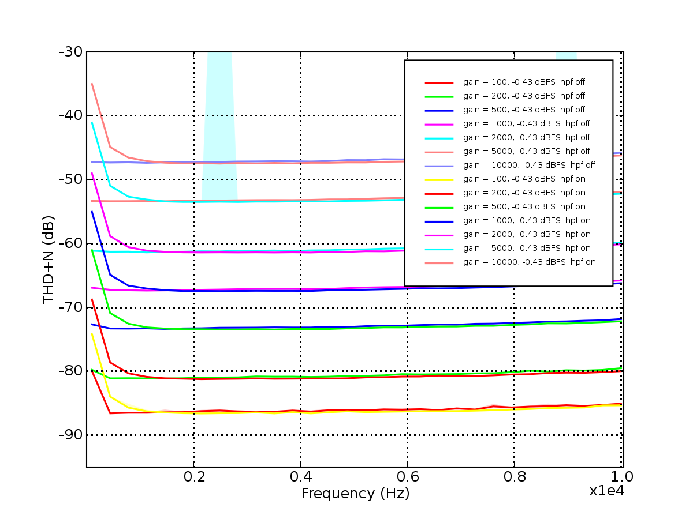
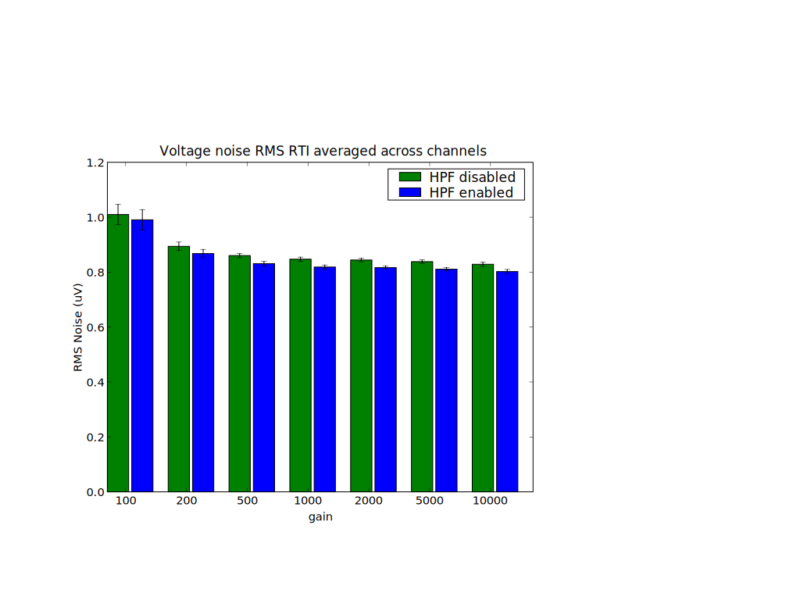
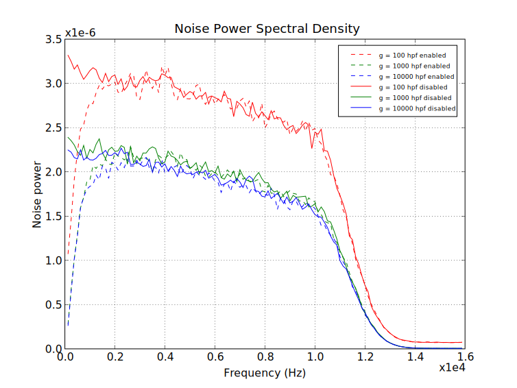
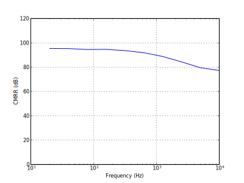

***********
Performance
***********

Measuring analog performance of programmable-gain amplification with
selectable filtering results in a wide range of configurations to test. 

THD + N
==================

Total harmonic distortion plus noise (THD+N) measures the ratio of a
fundamental signal to the power in all other harmonics and noise over
a targeted bandwidth :bibcite:`kester_understand_2008` . We measure
THD+N by using test signals at multiple frequencies. We follow the
IEEE standard for digitizing waveform recorder :bibcite:`_ieee_2008-1` to
fit the sine wave.

   
   Total Harmonic distortion + noise measured across frequencies, gains,
   and high-pass filter settings at -0.43 dBFS. 

Figure FIXME:ref fig shows THD+N across frequencies, with more
negative values reflecting a lower (better) THD+N. Each measurement
was run ten times, with the range indicated by a partially-transparent
envelope. In general, this range is very small, except at two points
where the wave-finding algorithm failed to converge.  

The THD+N is reduced for low frequencies when the high pass filter is
on, which is not surprising -- the HPF attenuates the input carrier,
raising the effective noise floor. At higher gains the THD+N is worse, 
as expected -- higher gains necessitate a lower input voltage to reach
full-scale. With consistent input noise (see next section), the effective
THD+N decreases. 

RMS Voltage Noise
===================

By shorting the inputs to ground we measure the RMS noise
referred-to-input (RTI). In all cases the RMS noise is less
than one microvolt, and varies only slightly as a function of gain,
indicating that the bulk of noise contribution is from the
input stage of the amplifier. 

   Voltage noise RMS, averaged across channels, for each gain
   and high-pass filter setting. 

Noise Spectra
==============

The noise spectra are relatively flat across our 10kHz bandwidth, and
is unsurprisingly attenuated at low frequencies when the high-pass
filter is enabled.

   Power spectral density of noise measurements. 

CMRR
==============

Our common-mode rejection is above 75 dB across our bandwidth of
interest, and 95 dB at 60 Hz. 

   Common-mode rejection across frequency. 
