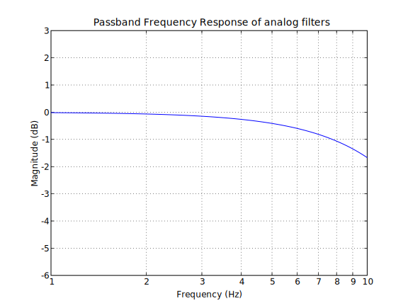
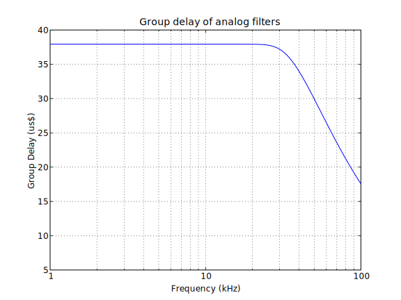
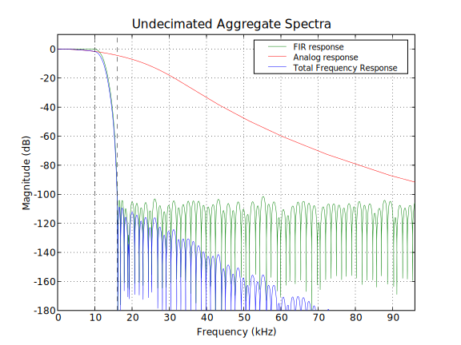
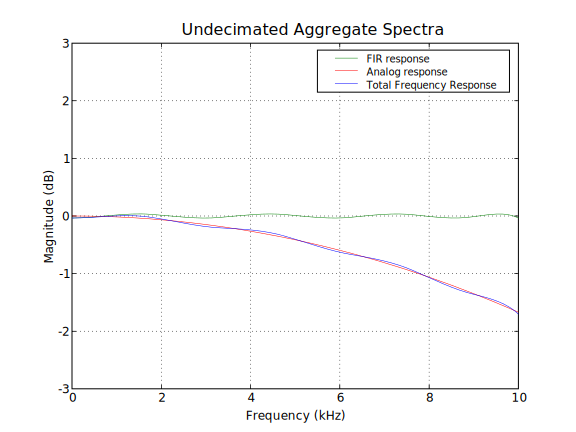
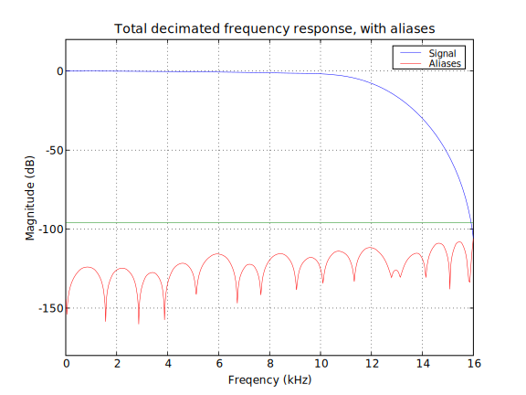

.. |pm| replace:: +- 

.. &plusmn;

**************
 Signal Chain
**************

This chapter outlines the design and implementation of the primary
Soma Acquisition signal processing chain, from low-level differential
input to encoded binary data at the output of the fiber
interface. This is a design chapter only; all figures are from
simulation and design specifications.

The Soma acquisition board signal chain (Figure \ref{signalchain}) can
be partitioned into an analog signal conditioning section and a
digital signal processing section. Here, the stages will be discussed
independently, except where they overlap and integrate to produce the
final output.

.. figure:: signalchain.svg
   :autoconvert:
   :pngdpi: 150

   The Soma Acquisition Signal Processing Chain

==================================
 Input Differential Amplification
==================================

There are an initial eight channels of input with high common-mode
rejection.  A constant gain of 100 results in a low-level bipolar
signal.  To accommodate the large DC offsets inherent in most
electrophysiology recording environments, the inputs are AC-coupled.

=============================================
Optional analog high-pass filtering
=============================================

Local field potential (LFP) waveform data is low-frequency in the mV
 range; spike data is high-frequency data in the hundreds-of-uV
 range. When recording spikes the low-frequency LFP could potentially
 saturate our amplifier; thus we have an optional single-pole
 high-pass filter ($f_{-3dB}=300 Hz$) that can be enabled to maximize
 spike acquisition dynamic range.

.. todo:: FIGURE Frequency response of the board below 1 kHz with and without theoretical

===================
 Programmable gain
===================

The programmable gain amplifier can be off or set to a range
of gains from 1 to 100; the table below shows the PGA gain, total
system gain, maximum input voltage, and LSB size for the possible
settings.

.. figure::
   ========   ===========  ===================  =========
   PGA gain   Total Gain   Input Voltage Range  LSB size 
   --------   -----------  -------------------  ---------
   1           100            |pm| 20.480 mV     625 nV
   2           200            |pm| 10.240 mV     312 nV
   5           500  	   |pm| 4.096 mV      	 125 nV
   10          1000 	   |pm| 2.048 mV       	 62.5 nV
   20          2000 	   |pm| 1.024 mV       	 31.3 nV
   50          5000 	   |pm| 0.410 mV       	 12.5 nV
   100         10000 	   |pm| 0.205 mV       	 6.3 nV
   ========   ===========  ===================  =========

============================
Analog to Digital Conversion
============================

Signal chain design: to achieve 16-bits with an input bandwidth of 10
kHz we oversample, downsample, and digitally filter. The filtering
process is the combination of the following factors:

  - an initial antialiasing filter
  - The analog-to-digital conversion step
  - fixed-point FIR filtering
  - downsampling

---------------------
Antialiasing Filter
---------------------
To achieve our desired sampling rate, an 8-pole Bessel filter
achieves greater than 96 dB attenuation within the stop-band while
maintaining linear phase (constant group delay) across the passband.

.. figure:: soma-1.analog.freqres.svg
   :autoconvert:
   :latexwidth: 5in

   Anti-aliasing filter total frequency response.

   Antialiasing filter passband frequency response

   Anti-aliasing filter group delay.

------
ADC
------

A 16-bit ADC running at $f_s=192 \textrm{kHz}$ samples the incoming
antialiased signal.

----------
Filtering
----------

We filter the sampled data using an 143-Tap FIR filter using fixed-point
convolution. We use an extended-precision multiplier, 22-bit filter
coefficients, and an extended-width accumulator to reduce the negative
artifacts present in fixed-point arithmetic.

The Parks-McClellan optimum equiripple FIR filter is used for a cutoff
at 10 kHz; the resulting frequency response (and coefficient-quantized
frequency response) are seen in figure \ref{FIR}. The 143-tap filter
gives the required stopband attenuation while keeping FIR-induced
passband ripple to under $0.5 dB$, while fitting in our allocated FPGA
resources.

.. figure:: soma-1.digital.quant.svg
   :autoconvert:
   :latexwidth: 5in

   Frequency response of FIR filter.

-------------
Downsampling
-------------

We filter and then downsample; the filtering step is actually only
performed once for every M=6 input samples, as the other M-1
samples would be removed in the decimation step and thus be wasted.

======================================
Total response, designed and measured
======================================

The resulting frequency response of the combined analog and digital
filters are shown in figures blah, including zoomed-in passband and
stopband performance. The frequency response following decimation is
also shown, with the sum of the (imperfectly filtered) antialiased
components highlighted.

   Aggregate pre-decimation signal chain filtering.

   Aggregate pre-decimation signal chain passband.

   Aggregate post-decimation filtering.

=======================
Digital Output
=======================

The resulting sampled bytes are transmitted at 32 ksps over
an 8MHz 8b/10b-encoded link. A separate input 8b/10b link
sends commands to control gain, filter settings, and the like. 

TODO: cite mode. 

Transmission of the a serial bitstream requires the receiver to
synchrnize to the bitstream so as to determine bit boundaries. Transitions
between one and zero bits can be used to infer the clocking parameters, 
but long strings of ones or zeros may result in a gradual precssion and,
eventually, a bit error. To prevent this, we use the 8b/10b encoding scheme. 

8b/10b encodes 8-bit symbols in 10 bits of data
:bibcite:`Widmer_DC-Balanced_1983` selecting code words to guarantee a
bit transition at least every six bits. 8b/10b also includes some
framing ("comma") characters which simplify packet identification.
